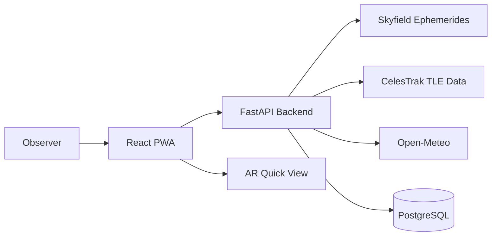

# LUNA

[](docs/releases/v2.0.0.md)
[](backend/README.md)
[](web/package.json)
[](LICENSE)

LUNA helps people answer a simple question quickly: what can I see in the sky right now, and when is the best time to look?

Under the hood, it combines a FastAPI backend for astronomy calculations with a React web app built for everyday use on both desktop and mobile.

Current version: v2.0.0

> If you are new here, start with the quick start section below, run the app locally, and open `/docs` to explore the API.

## At a glance

| Area | What you get |
| --- | --- |
| Observation | Moon, planet, satellite, and mission visibility in one workflow |
| Guidance | Direction, altitude, timing, quality score, and AR assistance |
| Platform | FastAPI backend, React PWA frontend, Docker Compose deployment |
| Data | Skyfield ephemerides, CelesTrak TLEs, Open-Meteo weather |
| Release baseline | Version 2 with semantic versioning and release workflow |

## Why people like using it
- It is built around real observation decisions, not just raw astronomy numbers.
- The dashboard moves quickly from location to direction, timing, and visibility.
- AR mode works well for field use when you want to point and identify fast.
- Docs, wiki pages, and release tooling are already in place for team collaboration.

## What LUNA provides
- Moon visibility windows, rise and set timing, best-view calculation, illumination, and phase context.
- Planet visibility and directional tracking for supported bodies.
- Satellite pass prediction, track plotting, visible-satellite discovery, and alert registration.
- Mission management for tracked spaceflight programs with linked tracking identifiers.
- Browser-based AR guidance using device camera and orientation.
- Responsive PWA web interface optimized for mobile and desktop use.

## v2 highlights
- Refined dashboard layout with clearer visual hierarchy and stronger data emphasis.
- Improved moon phase presentation and viewing score card.
- Live Identify quick tool for matching camera direction to visible satellites.
- Better installability with PWA prompts and offline shell support.
- Formal semantic versioning workflow with automated version bump tooling.

Release notes: [docs/releases/v2.0.0.md](docs/releases/v2.0.0.md)

## Core experiences

### Sky Window
- Unified visibility cards for moon, planets, satellites, and missions.
- Best-view timing, direction, altitude, and observation score in one screen.

### Live Identify
- Match the phone camera direction with predicted visible satellites.
- Built for immediate field use rather than offline post-processing.

### AR Quick View
- Camera-led directional guidance with mobile-friendly fullscreen flow.
- Useful when the user wants to aim quickly without reading a dense chart.

### Team-ready workflow
- Versioned docs, contributor guidance, wiki pages, and scripted semantic version bumps.

## Architecture summary
- Backend: FastAPI, Skyfield, SQLAlchemy, PostgreSQL or SQLite fallback.
- Frontend: React, Vite, Tailwind CSS, TanStack Query, Framer Motion, Leaflet.
- Infra: Docker Compose with Nginx reverse proxy.
- Data sources: Skyfield ephemerides, CelesTrak TLE data, Open-Meteo weather.

Detailed architecture: [docs/architecture.md](docs/architecture.md)



## Feature matrix

| Capability | Moon | Planets | Satellites | Missions |
| --- | --- | --- | --- | --- |
| Visibility window | Yes | Yes | Yes | Linked tracking |
| Direction and altitude | Yes | Yes | Yes | Via tracking |
| Best-view timing | Yes | Yes | Pass-based | Mission-dependent |
| Track visualization | Limited | Limited | Yes | Yes |
| AR support | Yes | Yes | Yes | Contextual |
| Alerts | No | No | Yes | Indirect |

## Repository layout
- backend/: FastAPI service, astronomical services, models, and API routers.
- web/: React web application and PWA shell.
- docs/: product, architecture, API, release, and versioning documentation.
- wiki/: GitHub-ready wiki pages stored in-repo.
- tools/: maintenance scripts, including semantic version bumping.
- data/: sample and mission data.

## Quick start

### Local backend
```bash
cd backend
python -m venv .venv
. .venv/Scripts/activate
pip install -r requirements.txt
uvicorn app.main:app --reload --host 127.0.0.1 --port 8000
```

### Local web app
```bash
cd web
npm install
npm run dev -- --host --port 3000
```

Set `VITE_API_BASE=http://localhost:8000` for direct local development, or `/api` when fronted by Nginx.

### Docker Compose
```bash
docker compose up -d --build
```

Services:
- backend: internal port 8000
- web: internal port 3000
- nginx: external ports 80 and 443
- db: PostgreSQL 16

More setup guidance: [docs/getting-started.md](docs/getting-started.md)

## Quick API examples

### Health check
```bash
curl http://127.0.0.1:8000/health/
```

### Moon window for a location
```bash
curl "http://127.0.0.1:8000/moon/window?lat=11.532939&lon=76.1288&days=7"
```

### Visible satellites near a location
```bash
curl "http://127.0.0.1:8000/satellite/visible?lat=11.532939&lon=76.1288&hours=12&limit=10"
```

### Create an alert for a tracked object
```bash
curl -X POST http://127.0.0.1:8000/alerts/ \
	-H "Content-Type: application/json" \
	-d '{
		"identifier": "ISS",
		"lat": 11.532939,
		"lon": 76.1288,
		"threshold_minutes": 10,
		"callback_url": "https://example.com/webhook"
	}'
```

## API surface
Primary route groups:
- `/health`
- `/moon`
- `/planet`
- `/satellite`
- `/mission`
- `/alerts`

Interactive OpenAPI docs are available from the running backend at `/docs`.

Full API guide: [docs/api.md](docs/api.md)

## Deployment notes
- The default stack is designed around Docker Compose.
- TLS can be terminated by Nginx with mounted Let's Encrypt certificates.
- AWS builds can use custom Python package mirrors through `PIP_INDEX_URL`, `PIP_EXTRA_INDEX_URL`, and `PIP_TRUSTED_HOST`.

Recommended deployment reference: [docs/release-process.md](docs/release-process.md)

## Documentation index
- [docs/getting-started.md](docs/getting-started.md)
- [docs/architecture.md](docs/architecture.md)
- [docs/api.md](docs/api.md)
- [docs/versioning.md](docs/versioning.md)
- [docs/release-process.md](docs/release-process.md)
- [docs/releases/v2.0.0.md](docs/releases/v2.0.0.md)
- [CONTRIBUTING.md](CONTRIBUTING.md)

## Roadmap direction
- Expand quick tools beyond Live Identify into aircraft, meteor, and deep-sky guidance.
- Keep improving the mobile-first flow for real field use.
- Keep API contracts stable and versioned as the platform grows.

## Semantic versioning policy
LUNA uses semantic versioning:
- `major` (`X.0.0`): breaking API or compatibility changes.
- `minor` (`X.Y.0`): backward-compatible feature additions.
- `fix` (`X.Y.Z`): backward-compatible bug fixes.

FastAPI-aligned interpretation:
- If an endpoint contract changes incompatibly, bump major.
- If an endpoint or field is added without breaking existing clients, bump minor.
- If behavior is corrected without changing the contract, bump fix.

## Automated version bumping
Use the repository script to update all tracked version locations together:

```bash
python tools/version_bump.py --part major
python tools/version_bump.py --part minor
python tools/version_bump.py --part fix
```

Set an explicit version:

```bash
python tools/version_bump.py --set 2.1.3
```

Preview a bump without writing files:

```bash
python tools/version_bump.py --part minor --dry-run
```

Script reference: [tools/version_bump.py](tools/version_bump.py)

## Release workflow
1. Run backend and frontend verification.
2. Bump the version with `tools/version_bump.py`.
3. Commit using a release message such as `release: v2.1.0`.
4. Create and push a Git tag: `git tag v2.1.0` and `git push origin v2.1.0`.
5. Publish release notes and update the GitHub Wiki if needed.

Detailed process: [docs/release-process.md](docs/release-process.md)

## GitHub Wiki content
The repository includes a `wiki/` directory with pages prepared for GitHub Wiki publication:
- [wiki/Home.md](wiki/Home.md)
- [wiki/Getting-Started.md](wiki/Getting-Started.md)
- [wiki/Architecture.md](wiki/Architecture.md)
- [wiki/API-Overview.md](wiki/API-Overview.md)
- [wiki/Releases-and-Versioning.md](wiki/Releases-and-Versioning.md)

## Credits
- Skyfield
- Open-Meteo
- CelesTrak
- WFd DeepTech Labs
